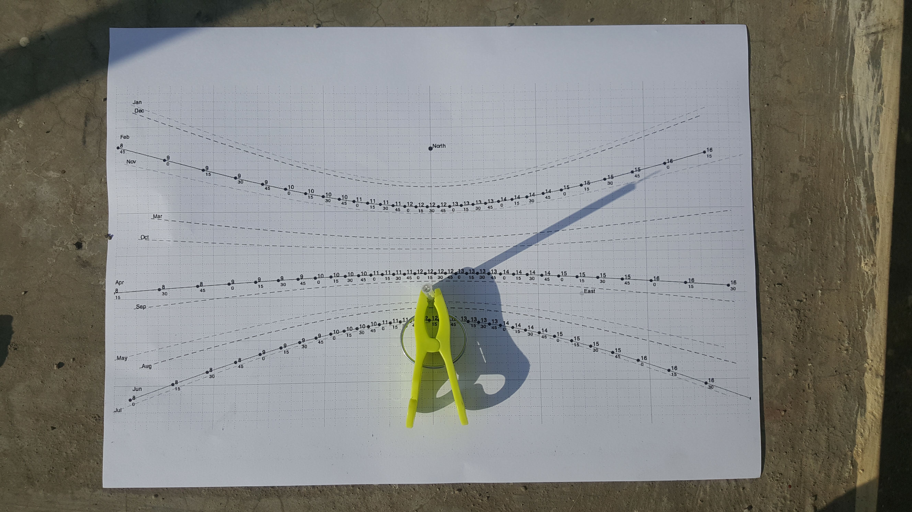

# Sun-and-Satellite-transit-predict
Given a year and the location on the earth (lat-lon), this code generates a sundial (printable on any sheet). This uses the rotation of earth and the position of the sun to trace out shadow paths of a Gnomon on the sheet.   

## Usage
1. Update the time and location parameters in sundail2021.m accordingly
2. run sundail2021.m to generate the transit path.
3. Sundail will be generated as a Matlab plot.
4. Print the plot on a A4 or any reasonably sized sheet.
5. Use a vertical stick (with length same as the bar on the plot) centered on the middle of the sundail and put it under sundail.

